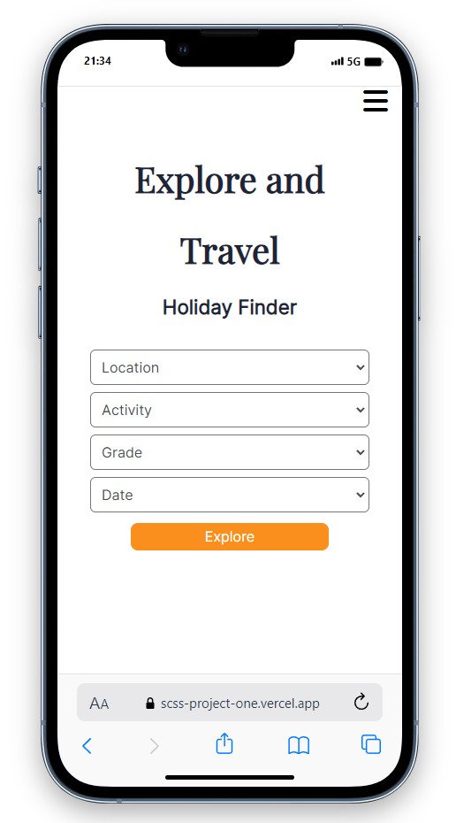
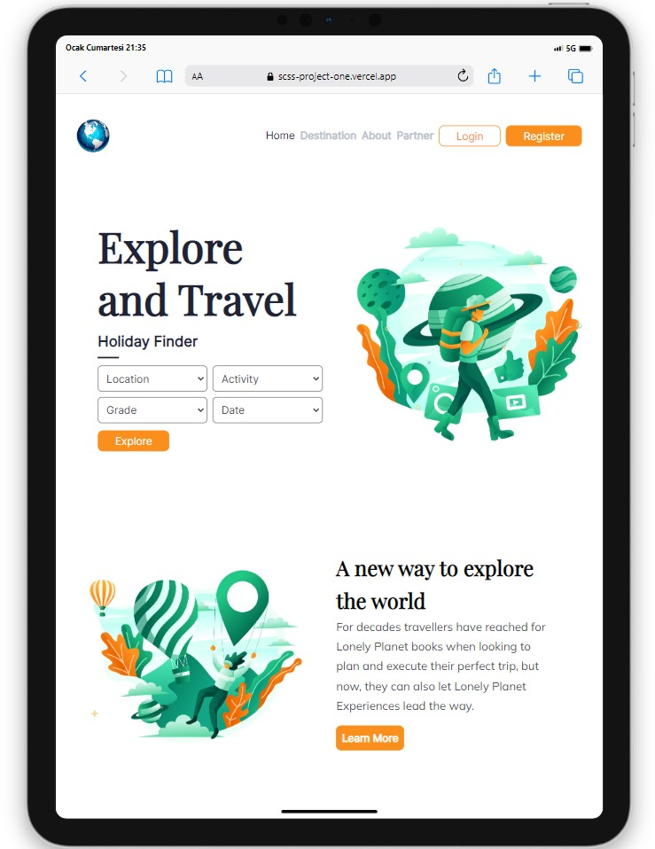
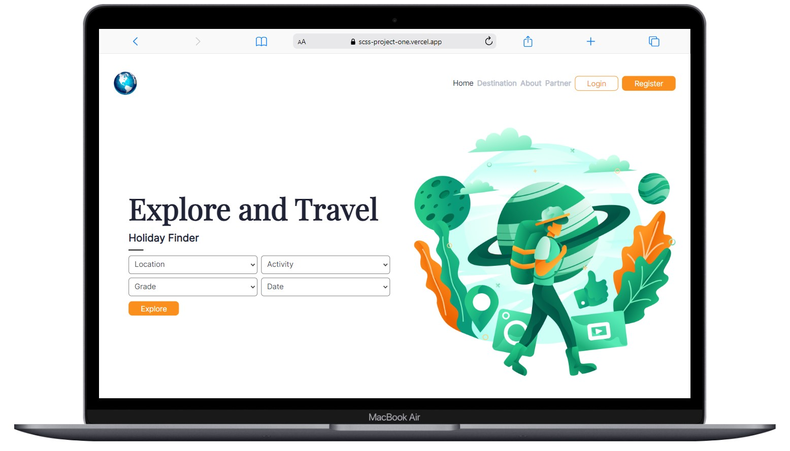

# Travel Site Design

  

## About the Project

This project includes a web design for a travel site, developed using HTML, SASS and JavaScript.

## Live Demo

[Travel Site Design](https://scss-project-one.vercel.app/)

## Technologies

- HTML
- SASS
- JavaScript

## Features

- Includes sections for Home, About, Destinations, and Guides.
- Mobile-friendly and responsive design.
- Utilizes Font Awesome and Google Fonts.

## Screenshots

  
  
  

## Compatibility

The project is compatible with both wide-screen computers and mobile devices.